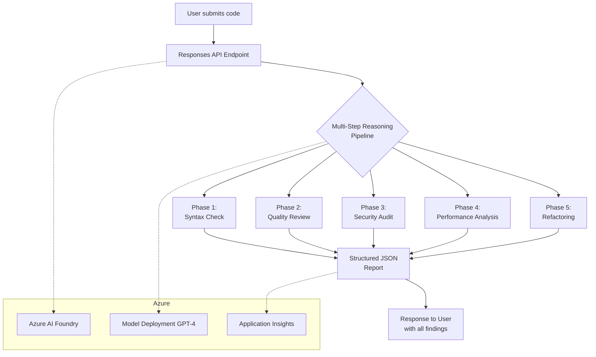

```mermaid
graph TD
    A[User submits code] --> B[Responses API Endpoint]
    B --> C{Multi-Step Reasoning<br/>Pipeline}
    C --> D[Phase 1:<br/>Syntax Check]
    C --> E[Phase 2:<br/>Quality Review]
    C --> F[Phase 3:<br/>Security Audit]
    C --> G[Phase 4:<br/>Performance Analysis]
    C --> H[Phase 5:<br/>Refactoring]
    D --> I[Structured JSON<br/>Report]
    E --> I
    F --> I
    G --> I
    H --> I
    I --> J[Response to User<br/>with all findings]
    
    subgraph Azure
        K[Azure AI Foundry]
        L[Model Deployment GPT-4]
        M[Application Insights]
    end
    
    B -.-> K
    C -.-> L
    I -.-> M
```