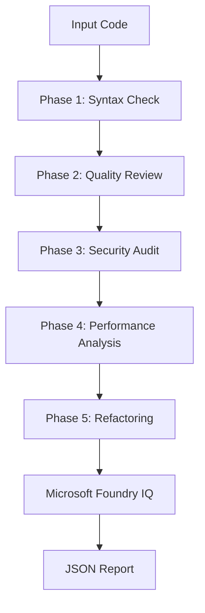

# 🤖 Eros Code Analysis Agent — Agents League Hackathon 2026


## 📖 Descripción

Agente de IA multi-step para análisis estático y dinámico de código, construido para el **Reasoning Agents Track** del Agents League Hackathon 2026. Integra Microsoft Foundry IQ para razonamiento estructurado en 5 fases.

## 🚀 Quick Start

### Prerrequisitos
- Python 3.11+
- pip
- (Opcional) Docker

### Instalar dependencias
```bash
pip install -r requirements.txt
```

### Ejecutar simulación
```bash
python run_simulation.py
```

### Ejecutar tests
```bash
pytest test_agent.py -v
```

### Demo avanzada
```bash
python demo_enhanced.py
```

## 🏗️ Arquitectura



## 🛠️ Stack Tecnológico

| Componente | Tecnología |
|------------|------------|
| Lenguaje | Python 3.11+ |
| Framework | FastAPI 0.110+ |
| IA/ML | OpenAI gpt-4.1-mini, gpt-image-1.5 |
| Observabilidad | OpenTelemetry, Jaeger, Prometheus |
| Despliegue | Docker, Kubernetes, Azure |
| Testing | pytest |
| CI/CD | GitHub Actions |

## 📚 Documentación

- Swagger UI: `http://localhost:8000/docs` (cuando el servidor está corriendo)
- [DEPLOYMENT.md](DEPLOYMENT.md) — Guía de despliegue en Azure
- [API.md](API.md) — Referencia de endpoints

## 🔄 CI/CD

- **CI/CD:** GitHub Actions pipeline configurado (`ci-cd.yml` + `reusable-python-ci.yml`)
- **Tests:** pytest + coverage + Docker build automatizados
- **Security:** Bandit + Safety scans integrados
- **Deploy:** Azure deploy pipeline preparado

## ✅ Definition of Done

- [x] Pipeline de 5 fases implementada
- [x] Tests unitarios pasan
- [x] Cobertura de código >= 70%
- [x] Documentación de arquitectura completa
- [x] CI/CD GitHub Actions configurado
- [ ] Despliegue en Azure (azd)

## 🤝 Cómo contribuir

1. Haz un fork del repositorio
2. Crea una rama: `git checkout -b feature/nueva-fase`
3. Commit: `git commit -m 'feat(agent): add Phase 6: License Compliance'`
4. Push: `git push origin feature/nueva-fase`
5. Abre un Pull Request

**Requisitos:** Incluir tests y actualizar diagrama de arquitectura.

## 📄 Licencia

Este proyecto está bajo la licencia **MIT**.

## 📅 Última actualización

2026-07-24

## 📊 Roadmap Estratégico

- **H0 (Hackathon):** ✅ COMPLETADO - Demo 60-90 segundos
- **H1 (Post-hackathon):** 🔄 EN PROGRESO - CI/CD + PR Security Beta
- **H2 (Escala):** 📋 PLANIFICADO - Multi-lenguaje + Dashboard
- **H3 (Enterprise):** 📋 PLANIFICADO - SaaS + SOC 2 Compliance

Ver más detalles en: `docs/roadmap/FASE-1.txt` y `docs/roadmap/FASE3_STRATEGY.md`

---